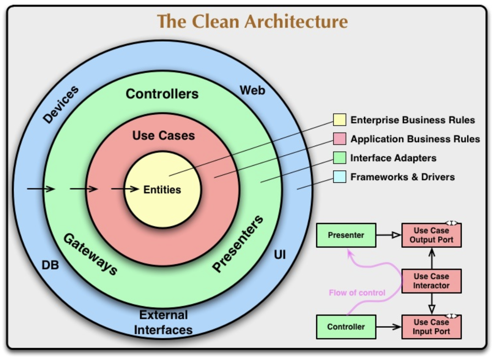

At it's simplest, an onion design model basically says layers of abstractions are separated by interfaces in the shape of concentric circles.

An example of something like this:

One main objective here is a clean [SoC](./vocabulary/soc.md) between abstractions.

The outermost circle is the highest level of abstraction, and the innermost circle is the lowest.  
Data always flows from the outermost layer to the innermost layer here.

Now what exactly these layers are, and what level of abstraction each layer denotes differs from model to model.
If we follow the quite famous Robert C. Martin's (Uncle Bob) ["Clean Code" architecture](https://blog.cleancoder.com/uncle-bob/2012/08/13/the-clean-architecture.html), we 

